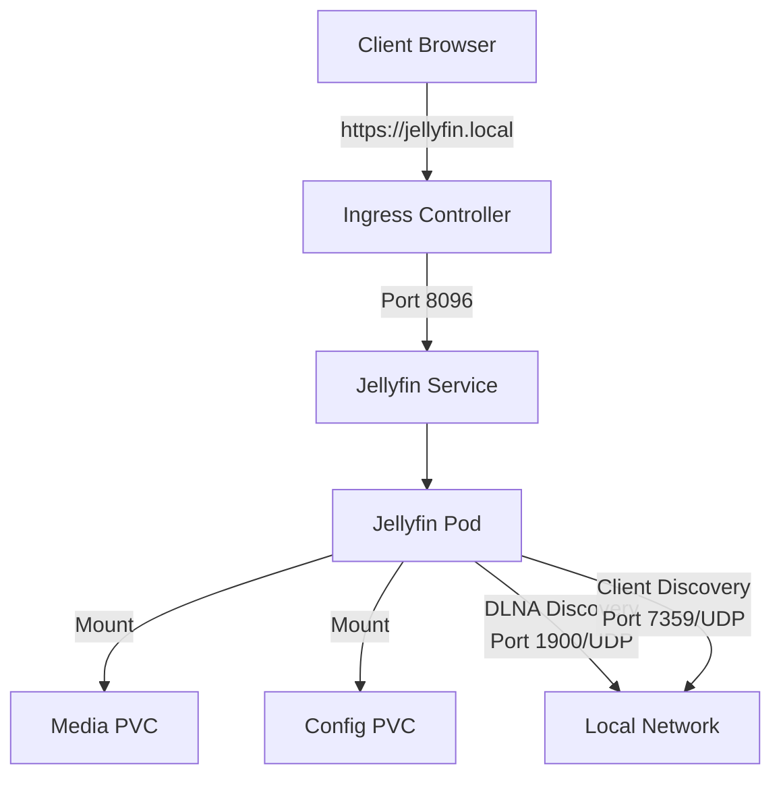

# Jellyfin on k3s

Media server deployment for k3s cluster.



## Components

- **Deployment**: Single replica running `jellyfin/jellyfin:latest`
- **Service**: Exposes ports 8096 (HTTP), 8920 (HTTPS), 7359/UDP (Discovery), 1900/UDP (DLNA)
- **Ingress**: Routes traffic from `jellyfin.local` to the service
- **Storage**: Persistent volumes for media and config

## Ports

- `8096`: Main web interface
- `8920`: HTTPS/SSL
- `7359`: UDP for client discovery
- `1900`: UDP for DLNA discovery

## Quick Start

1. Apply storage:
```bash
kubectl apply -f pv.yaml
kubectl apply -f pvc.yaml
```

2. Deploy Jellyfin:
```bash
kubectl apply -f deployment.yaml
kubectl apply -f service.yaml
kubectl apply -f ingress.yaml
```

3. Access at `https://jellyfin.local`
